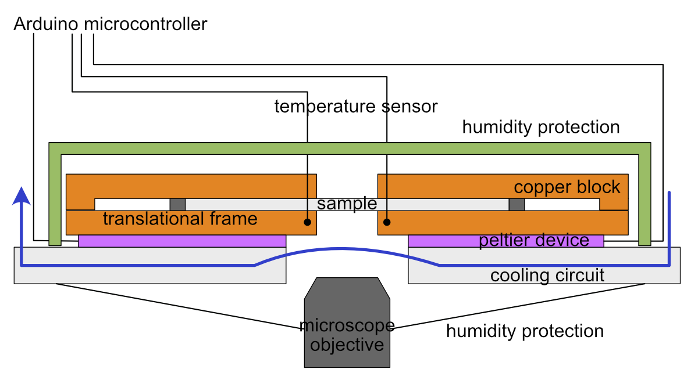

# Temperature Gradient Microscopy Stage

Microscopy stage with two temperature controlled metal block and a translational frame to move a sample in the temperature gradient by [D. Gerber](https://orcid.org/0000-0002-4231-0694) from the (now retired) [Soft and Living Materials Group at ETH Zürich](https://softliv.mat.ethz.ch/).

Detailed instructions to build the setup can be found in the [wiki](https://github.com/gerberli/temperature_gradient_microscopy_stage/wiki/).

  > [Building your own setup](https://github.com/dogerber/temperature_gradient_microscopy_stage/wiki/Building-your-own-Setup) 

  > [User manual (softliv group)](https://github.com/gerberli/temperature_gradient_microscopy_stage/wiki/Operation-manual)

This has been used for the following publications: 
* [Stress accumulation by confined ice in a temperature gradient (PNAS)](https://www.pnas.org/doi/10.1073/pnas.2200748119)
* [Polycrystalinity enhances stress build-up around ice (PRL)](https://pubmed.ncbi.nlm.nih.gov/38039453/)

# Setup overview
The setup consists of a PID control loop, where an Arduino microcontroller regulates the voltage for two peltier devices. Thermistors are placed in two copper blocks of variable spacing above the peltier devices and the opposite side of the peltier devices is held at room temperature by water cooling. The sample is placed on the copper block and can be moved relative to the temperature gradient by a linear actuator.

**Stage head**

 
 
 **Controller box**
 
 

**Schematic**

# Features
* 0.05 K temperature accuracy, when calibrated
* 0.01 K temperature stability
* Temperature range -25 to 60 °C (colder possible, if using coolant below room temperature)
* Variable spacing between metal blocks of 0-1 cm
* Translation of sample in the temperature gradient with 1.9 cm travel range and 300 nm stepsize
* Optional datalogging to microSD-card
* Optimized for microscope stages with 160x110 mm opening "Universal insert" [I-3091](https://www.asiimaging.com/products/stages-inserts/160-x-110-mm-slide-inserts/), but can be adapted

# Acknowledgement
Lawrence Wilen, Christian Furrer and Robert Style helped with the design of this stage and controller. The menu system used is [GEM](https://github.com/Spirik/GEM) by [Spirik](https://github.com/Spirik).

Inspiration for this stage was also taken from [Prof. Sylvain Devilles group](https://www.sciencedirect.com/science/article/pii/S0304399118300536).

